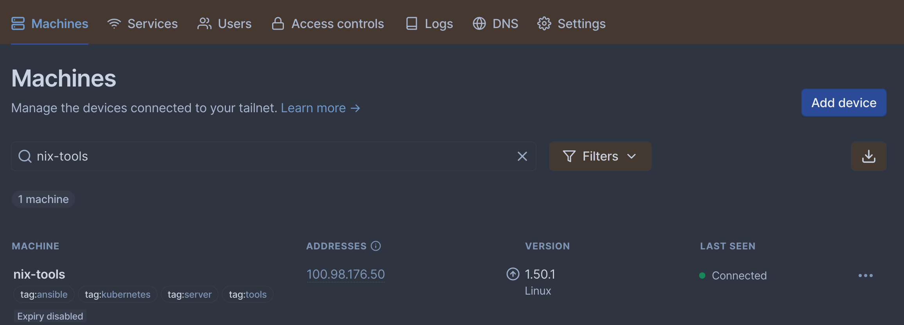
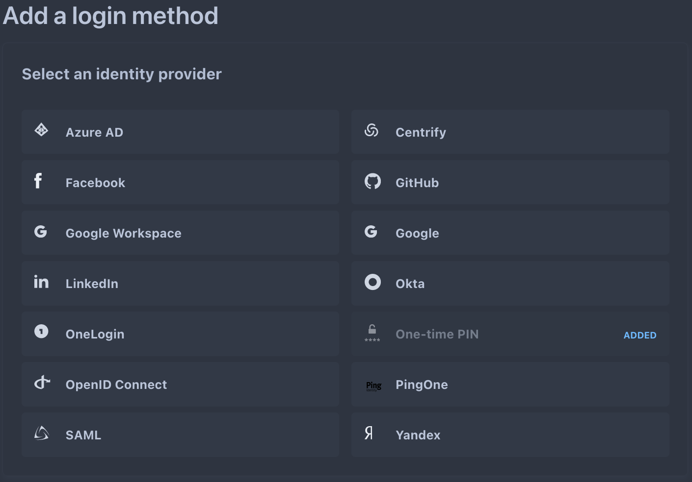

---
---

# Remote Access with Tailscale and Cloudflare Zero Trust

P.S.: If you would rather go all-in on Cloudflare's model, you can use Cloudflare WARP instead of Tailscale

---
<!-- footer: tailscale -->

## What is Tailscale?

Tailscale is a VPN provider that provides a mesh network for you to connect your devices:
- Extremely easy to use; cross-platform
- Mesh network is not invasive (if Tailscale goes offline on your device, non-Tailscale network traffic isn't disrupted)
- Based on open source WireGuard protocol
- Adds additional security features, such as Access Control Lists and identity awareness

---

## How Tailscale works

Tailscale has a nice blog post (and a great blog, overall) outlining all the details of how Tailscale works: https://tailscale.com/blog/how-tailscale-works/

The TL;DR: the Tailscale client will connect to other clients locally (i.e. mesh network) when possible, otherwise it routes over the internet. This results in an extremely fast, un-invasive experience. I.E. no dealing with configuring a network to make your VPN work.

---

## How I use Tailscale

Tailscale is my primary means for accessing my homelab.

I have implemented the following in my Tailnet:
- GitOps to deploy my ACL via a GitHub Action: https://tailscale.com/blog/gitops-acls/
- Extremely restrictive, role-based ACLs
- Role-based tags (i.e. devices tagged as `server` or `phone` have different rules)
- Mission-critical network services (SSH, PiHole, Mullvad SOCKS proxy, etc.)

---

## Things I haven't yet implemented with Tailscale

What I still want to implement:
- Automated deployment of Tailscale to my iPhone via Jamf: [GitHub issue](https://github.com/tailscale/tailscale/issues/1572)
- Meaningful logging/alerting
- Highly available/load-balanced services
- Integrated with Kubernetes
- Use Tailscale Funnel for exposing services I want to directly expose (Plex)
- Testing my ACLs for errors before committing/pushing them to my GitHub repository: [GitHub issue](https://github.com/tailscale/tailscale/issues/10098)

---
<!-- footer: tailscale-screenshots -->

## Some Tailscale screenshots

Admin Web Interface:



---

ACL snippet:


---

GitHub Actions:


---
<!-- footer: headscale -->

## Headscale: self-hosted alternative with most of the benefits

For my data-sovereignty/self-host-everything homies, check out Headscale:

https://github.com/juanfont/headscale

It implements most of the features of Tailscale, and can be used with the official Tailscale app

##### Disclaimer: I've never used Headscale -- so take what I say with a grain of salt

---
<!-- footer: cloudflare-zero-trust -->

## Cloudflare Zero Trust

Cloudflare Zero Trust (ZT) allows you to expose private resources with a convenient domain name.

In my setup, I run `cloudflared` on my Tailnet to proxy private resources through Cloudflare.

---

## Cloudflare ZT Identity Awareness

Identity awareness allows you to restrict applications to approved users.

Cloudflare integrates with the following identity sources for identity-awareness:



---

## How I use Cloudflare Zero Trust

The following components enable me to use Cloudflare ZT to securely access my services:
1. A domain registered and managed via Cloudflare
2. A `cloudflared` instance running in my Tailnet to expose private services
3. Application policies to restrict access to services

---

## Cloudflared tunnel

Cloudflared is a service that allows you to expose services that aren't normally routable to the internet.

My `cloudflared` tunnel runs in a container on a NixOS server in my home lab and uses my Tailnet for the private networking.

Here's my current NixOS configuration for `cloudflared-tunnel` container: [cloudflared.nix](https://github.com/heywoodlh/nixos-configs/blob/3ba58f8b5a4a60a96b16e55f533269180ca7a480/nixos/roles/remote-access/cloudflared.nix)

After registering your `cloudflared` tunnel with your Cloudflare Zero Trust, you can manage it via a config file or the Cloudflare ZT web UI.

---

Here's what a `cloudflared-tunnel` config file might look like:

```
tunnel: <some-uuid>
credentials-file: /etc/cloudflared/credentials.json

ingress:

  - hostname: someservice1.mydomain.com
    service: http://private-url-1

  - hostname: someservice2.mydomain.com
    service: http://private-url-2

  - service: http_status:404

```

---
<!-- footer: cloudflare-zt-screenshots -->
## Screenshots

Cloudflare ZT tunnels UI


---

Initial authentication screen


