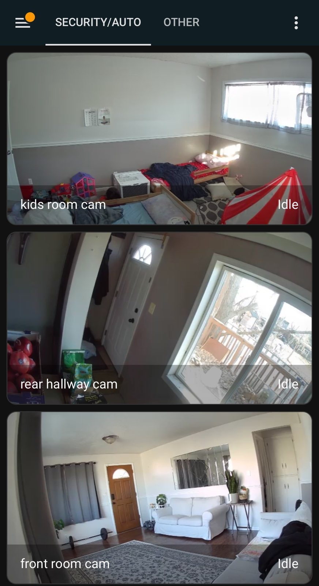

---
---

# Various topics

1. Breaking down my new Kubernetes cluster
2. Home Assistant installation in k8s

---
<!-- footer: kubernetes -->

## My new cluster


---

## My stack

Hardware:
- 2014 Apple Mac Mini, id: `macmini7,1`
- 8 GB RAM
- i5 CPU

Software:
- Ubuntu Server 22.04
- K0s: https://k0sproject.io/

---

## Why K0s on Ubuntu (vs something else NixOS)? 

I chose k0s + Ubuntu for the following reasons:
- Very little management on the underlying OS
- Trivial to deploy with `k0sctl` and SSH
- Flexibility to use Tailscale for _all_ networking
- Kubernetes is a more agnostic compute-plane than NixOS

---

## k0sctl + Tailscale

```
apiVersion: k0sctl.k0sproject.io/v1beta1
kind: Cluster
metadata:
  name: k0s-cluster
spec:
  hosts:
  - role: controller+worker
    ssh:
      user: heywoodlh
      port: 22
      address: 100.122.112.166
    privateInterface: tailscale0
    installFlags:
      - --kubelet-extra-args="--node-ip=100.122.112.166"
...
  k0s:
    version: v1.28.4+k0s.0
    dynamicConfig: false
    config:
      spec:
        network:
          provider: calico
          calico:
            mtu: 1280  # Tailscale
```

---

## Nix-managed Kubernetes Deployments:

```
nix build "github:heywoodlh/flakes?dir=kube#minecraft-bedrock"
kubectl apply -f ./result
```

See what's in my Kubernetes Nix flake:

```
nix flake show "github:heywoodlh/flakes?dir=kube"
```

---
<!-- footer: home-assistant -->

## Home Assistant

---

## The problem I needed to solve

Up until recently I was a very satisfied Apple Home user:
- Homekit is open source
- Apple Home usually "just works"
- My family uses Apple devices
- Apple Home is E2EE

After upgrading to iPhone 15, I can no longer share my Apple Home with my wife

---

## Other Apple Home downsides

Some other downsides (for me) of Apple Home:
- No troubleshooting tools (i.e. logs, network diagnostics, etc.)
- Closed-source backend
- Hubs are relatively dumb
- Only viable troubleshooting requires:
  - Reverse engineering
  - Reaching out to Apple Support

Overall, Apple Home presents a lack of technical visibility.

---

## Why Home Assistant?

Home Assistant is an open source smart home/automation platform.

Home Assistant has the following upsides:
- Open source, easily extended
- Vibrant community
- Works with a lot of hardware
- Compatible with most of my current HomeKit hardware

Some downsides of HA:
- Backend setup required
- Maybe a little too much flexibility

---

## Running Home Assistant in Kubernetes

Some issues quickly arose trying to deploy Home Assistant in K8s:
1. No official K8s deployment process (many third-party resources, though)
2. In order to better work with HomeKit, HA needs bluetooth and Wifi access
3. My HomeKit cameras weren't recognized by Home Assistant

R.E. bluetooth and wifi: relying on node hardware is a K8s anti-pattern

---

## Problem #1: writing a Kubernetes deployment for HA

Helm chart repos exist for HA, but often have lots of dependencies.

Someone's Kustomize repo on GitHub saved me a lot of time:

https://github.com/abalage/home-assistant-k8s

Allowed me to render the YAML with Kustomize.

---

## Problem #1.5: templating specific values in Nix

Prior to this, I didn't know of an easy way to substitute values in a file with Nix.

Helm essentially solves this problem: allows you to set values in a `values.yaml`.
I'm not using a Helm chart with this deployment, though.

Thankfully, I found the `substituteAll` Nix function.

---

This snippet:

```
          pkgs.substituteAll ({
            src = ./templates/home-assistant.yaml;
            namespace = "default";
            tag = "2023.11.3";
          });
```

Turns this (in `./templates/home-assistant.yaml`):

```
  namespace: @namespace@
  ...
          image: ghcr.io/home-assistant/home-assistant:@tag@
```

Into this:

```
  namespace: default
  ...
          image: ghcr.io/home-assistant/home-assistant:2023.11.3
```

---

## Problem #2: accessing wifi + bluetooth of node

My Mac Minis have nice bluetooth and wifi chips.

I documented how to setup bluetooth and wifi on the nodes here:

https://github.com/heywoodlh/flakes/tree/main/kube#notes-on-node-setup

However, setting up bluetooth and wifi on the nodes doesn't expose it to a Kubernetes deployment.

---

Here's how I fixed that in my Home Assistant deployment:

```
        securityContext:
          privileged: true
          capabilities:
            add:
              - NET_ADMIN
              - NET_RAW
              - SYS_ADMIN
        ...
        volumeMounts:
        ...
        - mountPath: /dev/ttyACM0
          name: ttyacm
        - mountPath: /run/dbus
          name: dbus
        ...
      volumes:
      ...
      - name: ttyacm
        hostPath:
          path: /dev/ttyACM0
      - name: dbus
        hostPath:
          path: /run/dbus
```

This allows the K8s deployment to access node hardware.

---

## Problem #3: hacking my Aqara HomeKit cameras

My cameras weren't being recognized by Home Assistant. Turns out other users had the same issue.

Thankfully, someone had already reverse engineered Aqara cameras and found an exploit I could use:

https://github.com/mcchas/g2h-camera-mods

This allowed me to turn on RTSP on the cameras and use the Aqara cams like a generic camera.

---

The result:


