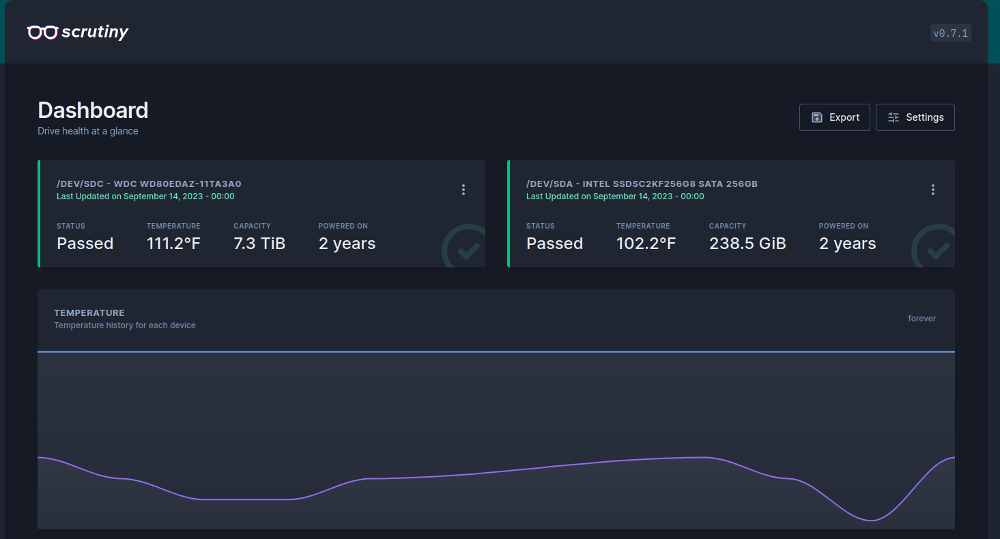
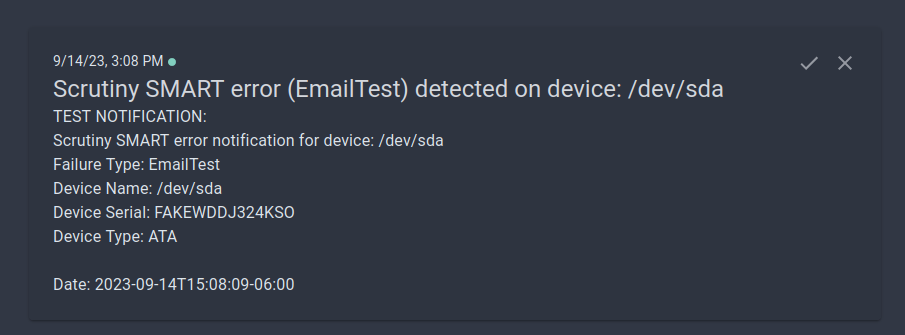
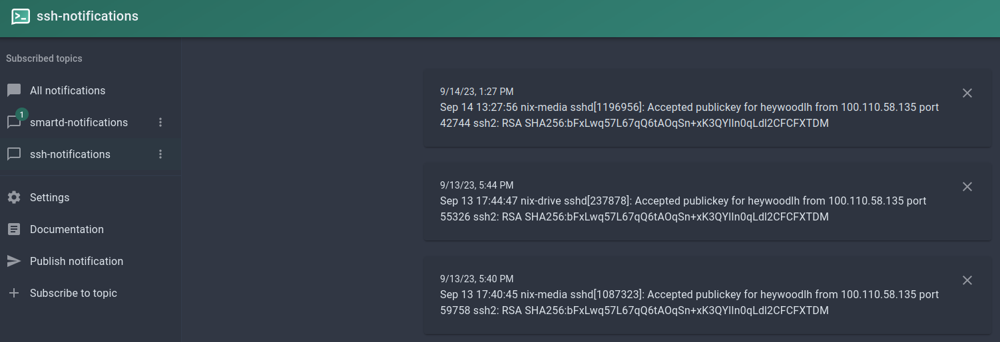

%title: Various topics for September 14, 2023
%author: heywoodlh

-> Random topics this week <-

---

-> S.M.A.R.T. <-

Self-Monitoring, Analysis, and Reporting Technology (S.M.A.R.T.) for storage devices:
- Supported by most modern storage devices
- Drive errors can often be detected before complete failure
- First introduced in 1994
- S.M.A.R.T. tooling is available for every OS: [Wikipedia: Comparison of S.M.A.R.T. tools](https://en.wikipedia.org/wiki/Comparison_of_S.M.A.R.T._tools)
- Many attributes are available: [Wikipedia: Known ATA S.M.A.R.T. attributes](https://en.wikipedia.org/wiki/Self-Monitoring,_Analysis_and_Reporting_Technology#Known_ATA_S.M.A.R.T._attributes)

## Smartd

Smartd is a S.M.A.R.T. monitoring daemon provided by smartmontools(https://www.smartmontools.org):
- Smartmontools is available for Linux, MacOS, Windows and FreeBSD
- Built-in notifications (i.e. email notifications on drive errors)

More info: 
[Wikipedia: Self-Monitoring, Analysis and Reporting Technology](https://en.wikipedia.org/wiki/Self-Monitoring,_Analysis_and_Reporting_Technology)
[Arch Wiki S.M.A.R.T. -- smartd](https://wiki.archlinux.org/title/S.M.A.R.T.#smartd)

---

-> Monitoring S.M.A.R.T. with scrutiny <-

Scrutiny is available on GitHub: https://github.com/AnalogJ/scrutiny

Provides the following features:
- Web-based dashboard for smartd
- Supports many notification services: [https://github.com/AnalogJ/scrutiny#notifications](scrutiny#notifications)
- Available as a container (bundled with smartd)

---

-> Scrutiny screenshots <-

---

-> Using NTFY for notifications <-

[NTFY](https://ntfy.sh/) is a self-hostable server for sending push notifications.

It's useful to run your own server for push notifications to alert yourself on events. Helpful for automation, monitoring, security, etc.

I use it to send myself notifications on the following:
- SSH alerts (somebody logged in, invalid user, etc.)
- SMART monitoring
- Uptime monitoring

NTFY features:
- Self-hostable (or just use the paid, cloud-hosted service)
- Extremely simple to send alerts: `curl -d "test-message" http://$MY_SERVER/test-notification`
- Clients for all major OS-es:
  - Web
  - Android ([F-Droid](https://f-droid.org/en/packages/io.heckel.ntfy/), or [Google Play](https://play.google.com/store/apps/details?id=io.heckel.ntfy))
  - iOS ([App Store](https://apps.apple.com/us/app/ntfy/id1625396347)) 

---

-> NTFY screenshots <-

---

-> iMessage on Linux (or other platforms) <-

Three ways I've been able to send and receive messages with iMessage on Linux:
- [Matrix](https://matrix.org) + [Matrix iMessage Bridge](https://github.com/mautrix/imessage)
- [Beeper.com](https://beeper.com): cloud-based service, based on Matrix -- bridges a lot more messaging services than just iMessage
- [AirMessage](https://airmessage.org): my recommendation for just iMessage -- it's really easy

Each of these solutions require a dedicated Mac (or jailbroken iPhone) running a service somewhere.

---

-> Matrix (self-hosted) or Beeper (cloud-based) for iMessage <-

## Matrix

Upsides:
- Self-hosted
- Open, extendable protocol
- End-to-end encrypted messaging protocol
- [Many more bridges for other services](https://matrix.org/ecosystem/bridges/) (WhatsApp, FB Messenger, Signal, Slack, Telegram, etc.)
- Many clients (web-based, mobile, desktop, etc.)

Downside:
- Extremely complicated to self-host
- Requires a dedicated Mac or jailbroken iPhone

## Beeper

Upsides:
- Based on Matrix -- most of the upsides of Matrix are relevant
- Zero maintenance, because you don't run it
- Many clients (web-based, mobile, desktop, etc.) -- you can use any Matrix client, or the Beeper app

Downsides:
- Not self-hosted
- Not as private, [review their privacy policy](https://www.beeper.com/privacy)
- Requires a dedicated Mac

---

-> AirMessage (my recommendation for iMessage) <-

Upsides:
- Extremely easy to setup
- Web-based client, or Android app

Downsides:
- Uses Google to easily connect to Mac server remotely
- Requires dedicated Mac

---

-> One more note on bridging messaging services <-

An easier to host alternative I would recommend for bridging other messaging services (outside of iMessage) is Bitlbee + Libpurple.

Upsides:
- Bridge multiple services into a single IRC server
- Use any IRC client you like

Downsides:
- IRC can be a little _too_ minimal for people
- Documentation/examples can be a bit confusing

I use Bitlbee to bridge the following messaging services:
- Discord
- Signal

My NixOS configuration for my Bitlbee is here: [bitlbee.nix](https://github.com/heywoodlh/nixos-configs/blob/2384369ccf7739e04f5d5e22afc5516344e4df32/nixos/roles/messaging/bitlbee.nix)

I use [TheLounge](https://thelounge.chat/) as a web-based front-end for Bitlbee. My NixOS configuration for TheLounge is here: [thelounge.nix](https://github.com/heywoodlh/nixos-configs/blob/2384369ccf7739e04f5d5e22afc5516344e4df32/nixos/roles/messaging/thelounge.nix)

Review the Arch Wiki for more information on Bitlbee and Pidgin (Libpurple):
- [Bitlbee](https://wiki.archlinux.org/title/bitlbee)
- [Pidgin/Libpurple](https://wiki.archlinux.org/title/Pidgin)
