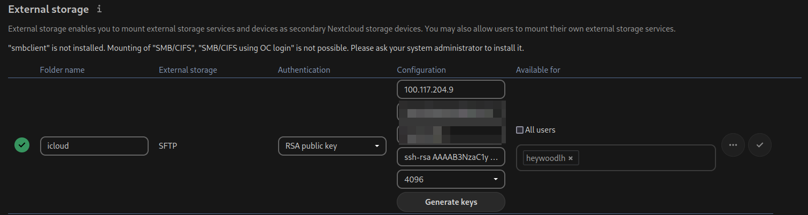
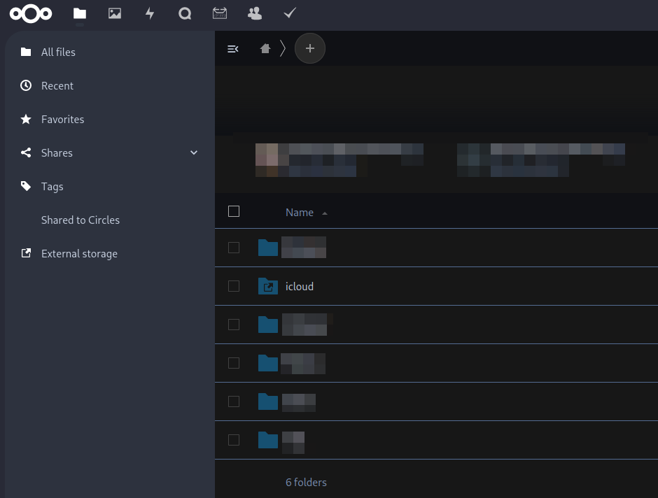
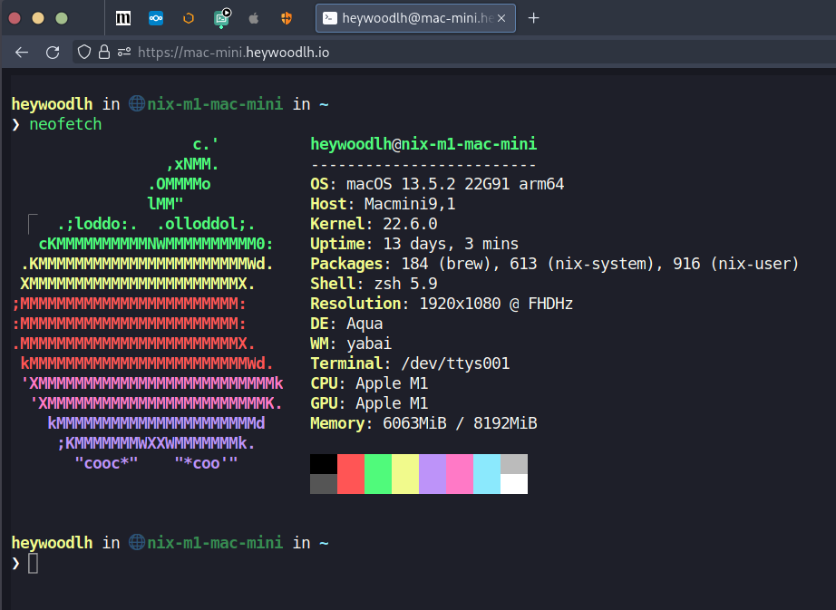
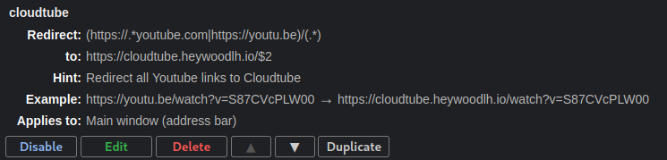
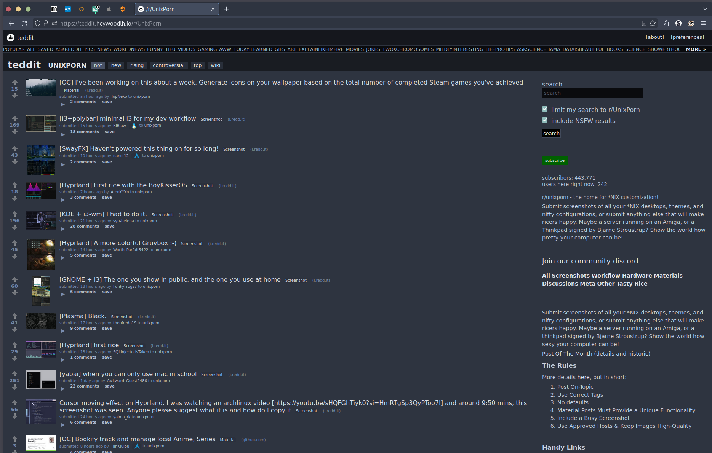

%title: Various topics for September 21, 2023
%author: heywoodlh

-> Nextcloud <-

Nextcloud is a self-hosted storage solution with many addons to provide full office suite functionality.

With the help of addons, it can be turned into a full alternative to G-Suite or Office 365.

https://nextcloud.com/

---

-> How I access iCloud Drive from Nextcloud <-

I have a dedicated Mac Mini for various Apple Services with iCloud Drive turned on.

iCloud Drive is accessible on MacOS at the following path:

```
~/Library/Mobile Documents/com~apple~CloudDocs
```

You can use the [External Storage plugin](https://docs.nextcloud.com/server/latest/admin_manual/configuration_files/external_storage_configuration_gui.html) to access files via SSH:
- Enable SSH on the Mac
- Configure the External Storage plugin to use the path to iCloud Drive on the Mac

---

-> Configure SFTP Nextcloud MacOS <-





---

-> SSH access in the browser using Cloudflare Zero Trust <-

Cloudflare Zero Trust has a nice feature for rendering SSH sessions in the browser.



[Connect with SSH through Cloudflare Tunnel](https://developers.cloudflare.com/cloudflare-one/connections/connect-networks/use-cases/ssh/)

---

-> Using an open source front-end for Youtube <-

For ad-free Youtube, I use a self-hosted front-end called CloudTube: https://sr.ht/~cadence/tube/


I use a Firefox extension named [Redirector](https://addons.mozilla.org/en-US/firefox/addon/redirector/) to automatically redirect Youtube links to CloudTube.

Here's my Redirector rule for Youtube links:



I use this Apple Shortcut on my iPhone to rewrite Youtube links to CloudTube: [Open in CloudTube](https://www.icloud.com/shortcuts/01d755eaed2c4f22b4683d8f2b96e511)

---

-> Using an open source front-end for Reddit <-

For a better, read-only Reddit experience, I use Teddit: https://codeberg.org/teddit/teddit



Similar to my Cloudtube setup, I have a Redirector rule to automatically redirect Reddit links to Teddit:


And an Apple Shortcut: [Open in Teddit](https://www.icloud.com/shortcuts/9ef4394b0bd34e0fadd79051fa540ecb)

---
