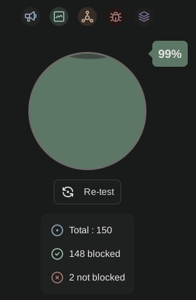
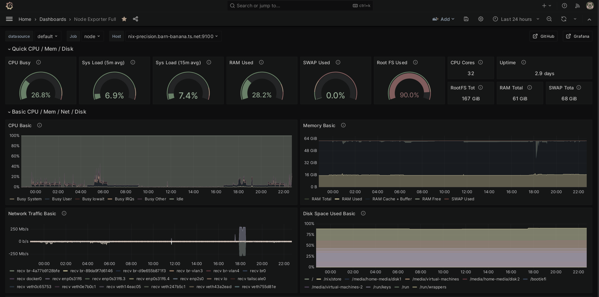
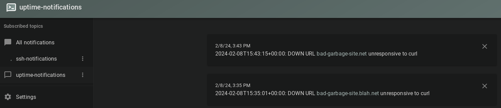

---
---

# Various topics

1. I like my new desk setup!
2. DNS improvements with NextDNS
3. Follow-up: Node-Exporter
4. Super simple k8s uptime monitoring

---

I like my new desk setup!


To the right is my work Macbook + Apple Studio Displays

To the left is a 2014 (Intel) Mac Mini running NixOS

---

<!-- footer: nextdns -->

## NextDNS

---

I killed my Pihole instance, and I was looking for a simple replacement.

[NextDNS](https://nextdns.io) is a paid-for DNS service that provides:
1. Ad-blocking, malware protection
2. DNS over HTTPS
3. Works out of the box with Tailscale
4. $20/year!

_If I were to self-host DNS again, I would go with AdGuard Home over Pihole:_
https://github.com/AdguardTeam/AdGuardHome

---

NextDNS + Mullvad Browser (Privacy Badger, uBlock Origin) = 99% blocked ads



Adblock test: https://d3ward.github.io/toolz/adblock.html

---
<!-- footer: node-exporter -->

## Node-Exporter

---

After Alex's presentation on node-exporter (on Jan. 17) I set up the stack!

The various configurations I am using are here:
- NixOS configuration: https://github.com/heywoodlh/nixos-configs/blob/3bb3a3ffc22690ef3d8e51db35fcc91267078c53/nixos/roles/monitoring/node-exporter.nix
- Prometheus in Kubernetes (with Helm+Nix): https://github.com/heywoodlh/flakes/blob/dc003916d7ff09ab13508dad595e1b73c5974777/kube/flake.nix#L348-L366
- Grafana in Kubernetes (with Helm+Nix): https://github.com/heywoodlh/flakes/blob/dc003916d7ff09ab13508dad595e1b73c5974777/kube/flake.nix#L194-L222

[Alex's presentation on Grafana, Prometheus, etc.](https://github.com/central-utah-lug/meetings/blob/main/2024/January/17/grafana-1-2024.md)

---

The end result:



---
<!-- footer: k8s-uptime -->

## Super simple Kubernetes uptime monitoring

---

My super simple uptime monitoring solution:

[bash-uptime](https://github.com/heywoodlh/bash-uptime)

Highlights:
- 231 line BASH script
- Containerized
- Simple YAML configuration
- Supports ICMP (ping) and HTTP monitoring

---

Configuration:

```
ping:
  hosts:
    - 1.1.1.1
    - google.com
    - bad-garbage-site.net
  options: "-c 1 -W 1"
  silent: "true"
curl:
  urls:
    - "http://google.com"
    - "http://bad-garbage-site.net"
  options: "-LI --silent"
  silent: "true"
```

---

Really easy to run with Docker!

```
❯ docker run -it -v /tmp/uptime.yaml:/app/uptime.yaml heywoodlh/bash-uptime

2024-02-08T23:28:25+00:00: UP Host 1.1.1.1 responded to ping
2024-02-08T23:28:25+00:00: UP Host google.com responded to ping
2024-02-08T23:28:26+00:00: DOWN Host bad-garbage-site.net unresponsive to ping
2024-02-08T23:28:26+00:00: UP URL http://google.com responded to curl
2024-02-08T23:28:26+00:00: DOWN URL http://bad-garbage-site.net unresponsive to curl
```

---

My solution for Kubernetes:
1. Run the container as a `CronJob` (on a schedule)
2. Create push notifications in my NTFY instance (which go to my phone)
3. Use Tailscale and Kubernetes' internal networking

_NTFY is the simplest way to self-host push notifications, imo_

---

```
...
apiVersion: batch/v1
kind: CronJob
metadata:
  name: uptime
spec:
  schedule: "*/5 * * * *"
  jobTemplate:
    spec:
      template:
        spec:
          containers:
          - image: 
            name: uptime
            command:
            - "/bin/bash"
            - "-c"
            args:
            - "/app/uptime.sh | tee /tmp/uptime.log; grep DOWN /tmp/uptime.log | xargs -I {} curl -d \"{}\" http://ntfy.default"
...
```
---

End result



---

Various configs:
- ntfy k8s deployment: https://github.com/heywoodlh/flakes/blob/24af4e975d2ed7118ae1b1f317d8e0d8ede3eeb7/kube/templates/ntfy.yaml
- bash-uptime k8s deployment: https://github.com/heywoodlh/flakes/blob/24af4e975d2ed7118ae1b1f317d8e0d8ede3eeb7/kube/templates/uptime.yaml

