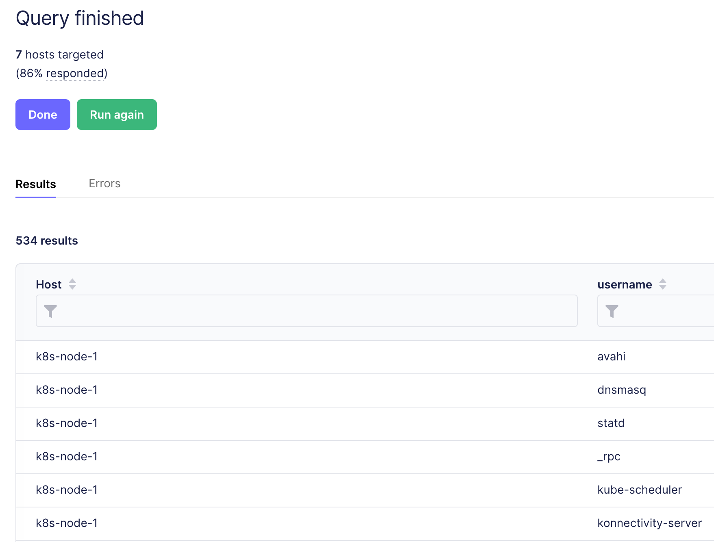

---
---

# Various topics

1. Lightweight VMs with Lima (powered by Nix)
2. FleetDM for workstation security

---
<!-- footer: lima -->

# VMs with Lima

[Lima](https://github.com/lima-vm/lima) is a command-line wrapper to quickly deploy QEMU VMs

- Powers Rancher and Podman Desktop
- Runs on MacOS and Linux
- Easy to use: `limactl start`
- Multiple pre-configured VM templates

Note: [colima](https://github.com/abiosoft/colima) makes it easy to deploy a Lima VM for Docker or Kubernetes

---

# My Lima Nix flake

https://github.com/heywoodlh/flakes/tree/main/lima

```
nix run github:heywoodlh/flakes?dir=lima#ubuntu-vm
```

---

# FleetDM (OSQuery)

FleetDM is a self-hostable front-end for [OSQuery](https://www.osquery.io/)

Additionally, there is a SaaS, cloud-based offering: https://fleetdm.com

---
<!-- footer: fleetdm -->

- OSQuery is a lightweight endpoint monitoring solution:
  - Open source, created by Facebook/Meta
  - Provides an SQL-like querying capability of your endpoint's state
  - First-class support for MacOS and Linux, Windows came later
  - Powers [Kolide](https://www.kolide.com/)

Note: FleetDM is a forked version of [Kolide's](https://www.kolide.com/) formerly open source Fleet server

---

# Questions OSQuery can answer

Is your operating system updated?

What applications are installed?

Are there any known vulnerable applications?

The OSQuery Schema demonstrates the data made available: [OSQuery Schema](https://osquery.io/schema)

---


---


---


